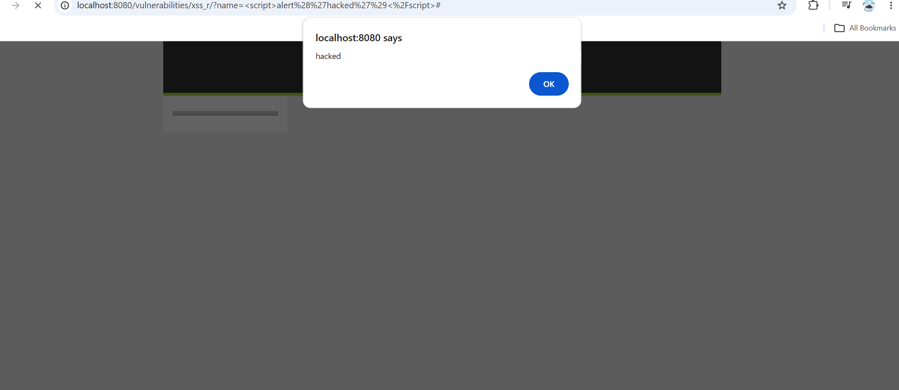

# Containerized Web Application Security Lab & Vulnerability Exploitation

> **Executive Summary:**  
> Architected a local, multi-container security testing environment using **Docker Compose** to simulate real-world web application vulnerabilities and attack vectors. Deployed target applications (**OWASP Juice Shop** and **DVWA**) alongside an offensive security container (**Kali Linux**). Executed manual exploits including **SQL Injection (SQLi)**, **Reflected Cross-Site Scripting (XSS)**, and **Admin Authentication Bypass**.

---

## 🏗️ Architecture & Lab Design

The environment leverages Docker networking to isolate target applications while enabling communication between the attacker container and targets.

```text
┌─────────────────────────────────────────────────────────────────────────┐
│                           Docker Desktop Host                           │
│                                                                         │
│   ┌────────────────────┐   ┌────────────────────┐   ┌───────────────┐   │
│   │   OWASP Juice Shop │   │        DVWA        │   │  Kali Linux   │   │
│   │   (Port 3000)      │   │     (Port 8080)    │   │  (Attacker)   │   │
│   └─────────▲──────────┘   └─────────▲──────────┘   └───────▲───────┘   │
└─────────────┼────────────────────────┼──────────────────────┼───────────┘
              └────────────────────────┴──────────────────────┘
                                  Local Host Browser
```

### Stack Components
* **OWASP Juice Shop (`port 3000`):** Modern Node.js/Angular web application containing OWASP Top 10 security flaws.
* **DVWA (`port 8080`):** PHP/MySQL vulnerable web application configured to "Low" security level for baseline exploitation testing.
* **Kali Linux Container (`kali_attacker`):** Attacker platform equipped with command-line penetration testing utilities (`nmap`, `sqlmap`, `curl`).

---

## 🛠️ Infrastructure Configuration

<details>
<summary><b>Click to view docker-compose.yml</b></summary>

```yaml
services:
  juice-shop:
    image: bkimminich/juice-shop
    ports:
      - "3000:3000"

  dvwa:
    image: vulnerables/web-dvwa
    ports:
      - "8080:80"

  kali:
    image: kalilinux/kali-rolling
    container_name: kali_attacker
    tty: true
    stdin_open: true
```
</details>

---

## ⚔️ Deep-Dive Vulnerability Exploitation

### 1. SQL Injection (DVWA)
* **Target:** `http://localhost:8080/vulnerabilities/sqli/`
* **Vulnerability Type:** Inband / Classic SQL Injection
* **Exploitation Method:** Entered `1' OR '1'='1` into the User ID parameter. 
* **Impact:** Broke the SQL syntax query structure, forcing the backend MySQL query to evaluate to true (`TRUE OR TRUE`) for all records, resulting in full user account credential dumping.


---

### 2. Reflected Cross-Site Scripting (DVWA)
* **Target:** `http://localhost:8080/vulnerabilities/xss_r/`
* **Vulnerability Type:** Non-Persistent Client-Side Code Execution
* **Exploitation Method:** Submitted `<script>alert('hacked')</script>` inside the `name` GET parameter.
* **Impact:** The application rendered user input directly into the HTML DOM without sanitization, triggering arbitrary JavaScript execution in the client browser context.



---

### 3. Administrator Authentication Bypass (OWASP Juice Shop)
* **Target:** `http://localhost:3000/#/login`
* **Vulnerability Type:** SQL Injection in Authentication Handlers
* **Exploitation Method:** Supplied `' OR 1=1--` as the email address with a dummy password.
* **Impact:** Neutralized the password check using SQL comment characters (`--`), allowing direct authentication as `admin@juice-sh.op` without authorization credentials.


---

## 🛡️ Remediation & Security Controls

| Vulnerability | Root Cause | Recommended Defense |
| :--- | :--- | :--- |
| **SQL Injection** | Unsanitized user input directly concatenated into backend SQL statements. | Implement **Parameterized Queries (Prepared Statements)** or Object-Relational Mapping (ORM). |
| **Reflected XSS** | Context-agnostic input rendering without HTML entity encoding. | Implement **Context-Aware Output Encoding** and enforce strict **Content Security Policy (CSP)** headers. |
| **Auth Bypass** | Insecure authentication queries accepting raw inline parameters. | Separate SQL logic from raw user data and utilize secure identity management standard frameworks. |